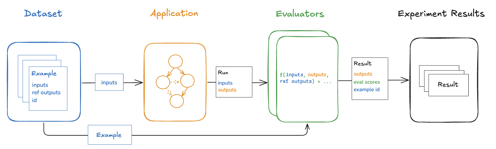
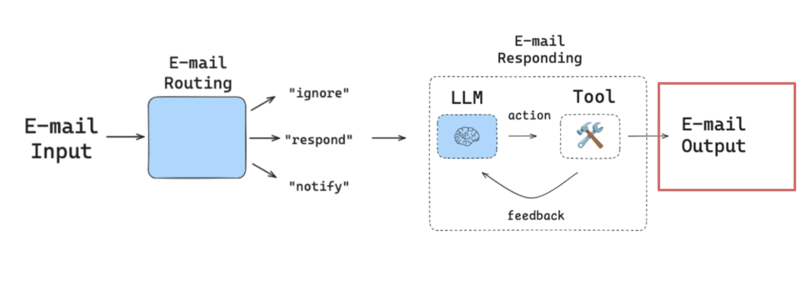
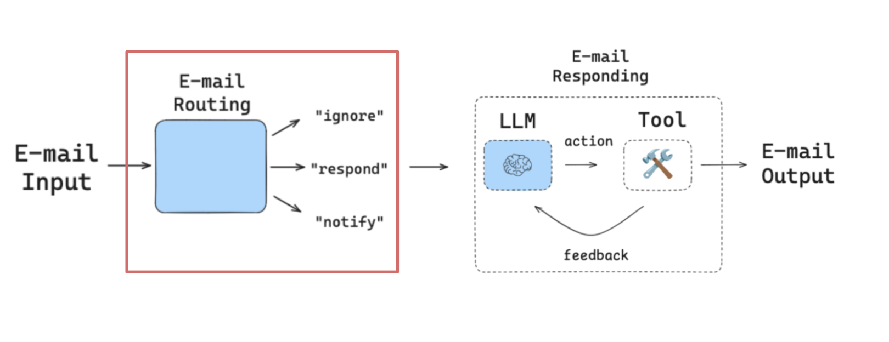
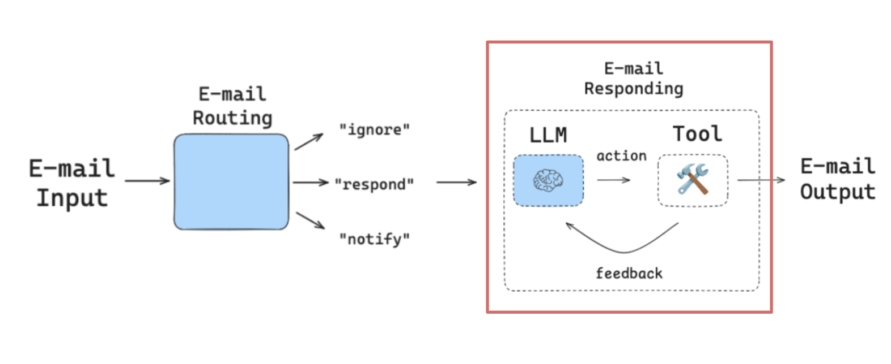
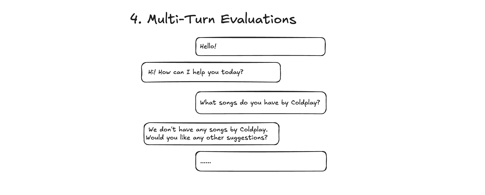

# LangSmith Agent Evaluation Cookbook

A hands-on guide to evaluating LLM agents with [LangSmith](https://smith.langchain.com). This cookbook walks through four evaluation patterns — **final response**, **single step**, **trajectory**, and **multi-turn** — using real agent examples built with [LangGraph](https://langchain-ai.github.io/langgraph/).

<p align="center">
  
</p>

## What You'll Learn

| Notebook | Evaluation Patterns | Description |
|----------|-------------------|-------------|
| [`email_basic.ipynb`](notebooks/email_basic.ipynb) | Final Response, Single Step, Trajectory | Evaluate an email triage-and-response agent using LangChain tools |
| [`email_mcp.ipynb`](notebooks/email_mcp.ipynb) | Final Response, Single Step, Trajectory | Same evaluation patterns applied to an agent that leverages MCP-based tools |
| [`multi_thread.ipynb`](notebooks/multi_thread.ipynb) | Multi-Turn Simulation | Simulate multi-turn conversations and evaluate a customer service multi-agent system |

## Evaluation Patterns

### Final Response Evaluations

Evaluate the complete agent output against success criteria using an LLM-as-judge.

<p align="center">
  
</p>

### Single Step Evaluations

Evaluate individual agent steps (e.g., triage classification) using exact-match metrics.

<p align="center">
  
</p>

### Trajectory Evaluations

Evaluate the sequence of tool calls made by the agent against expected trajectories.

<p align="center">
  
</p>

### Multi-Turn Evaluations

Simulate multi-turn conversations with synthetic users and evaluate across dimensions like resolution, satisfaction, and professionalism.

<p align="center">
  
</p>

## Getting Started

### Prerequisites

- Python 3.11+
- A [LangSmith](https://smith.langchain.com) account (`LANGCHAIN_API_KEY`)
- An [OpenAI](https://platform.openai.com) account (`OPENAI_API_KEY`)

### 1. Clone the repository

```bash
git clone https://github.com/xuro-langchain/eval-concepts.git
cd eval-concepts
```

### 2. Set up environment variables

Copy the example `.env` file and fill in your API keys:

```bash
cp .env.example .env
```

### 3. Install dependencies

**Using uv (recommended):**

```bash
uv sync
```

**Using pip:**

```bash
python3 -m venv .venv
source .venv/bin/activate
pip install -r requirements.txt
```

### 4. Run the notebooks

Launch Jupyter and open any notebook in the `notebooks/` directory:

```bash
jupyter notebook notebooks/
```

**Recommended order:**
1. **`email_basic.ipynb`** — Core evaluation patterns (final response, single step, trajectory)
2. **`email_mcp.ipynb`** — Same patterns with MCP tool integration
3. **`multi_thread.ipynb`** — Multi-turn simulation evaluations

## Project Structure

```
eval-concepts/
├── notebooks/               # Evaluation tutorial notebooks
│   ├── email_basic.ipynb        # Core eval patterns
│   ├── email_mcp.ipynb          # MCP variant of email evaluations
│   └── multi_thread.ipynb       # Multi-turn simulation evaluations
├── agents/                  # Agent implementations
│   ├── email_basic.py           # Email agent with LangChain tools
│   ├── email_mcp.py             # Email agent with MCP tools
│   └── multi_basic.py           # Multi-agent customer service system
├── tools/                   # Tool definitions
├── utils/                   # Helper utilities and prompts
├── images/                  # Diagrams used in notebooks
├── config.py                # LangSmith client configuration
└── .env.example             # Required environment variables
```
